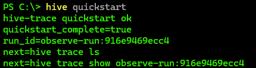
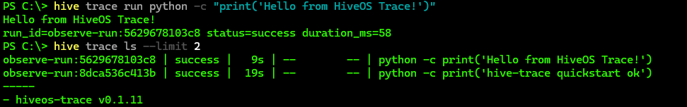
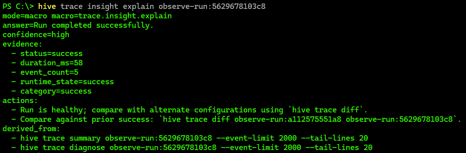
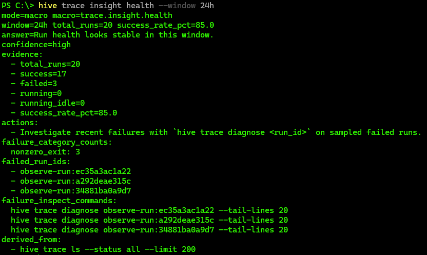

# HiveOS Trace

Drop-in observability for non-deterministic and agentic workflows.

Wrap an existing command, capture execution traces, and turn them into actionable insight.

## Install

```powershell
pipx install hiveos-trace
```

Fallback:

```powershell
python -m pip install hiveos-trace
```

## Quickstart Command

```powershell
hive quickstart
```

No-browser variant:

```powershell
hive quickstart --no-open
```

## 60-Second Quickstart

```powershell
hive trace run --no-open -- python -c "print('hello trace')"
hive trace ls --limit 5
hive trace insight explain <run_id>
```

## Command Model

- Primitives: `hive trace ...`
- Insight macros: `hive trace insight ...`
- Ops lifecycle: `hive trace ops ...`

## What You Get (By Integration Level)

| Integration level | What works |
|---|---|
| Zero instrumentation (wrapper only) | `trace run`, `trace ls`, `trace show`, `trace summary`, `trace diff`, `trace diagnose`, `trace insight explain/drift/health` |
| Instrumented workflow (step/checkpoint emitters) | Anchor discovery (`trace anchors`), anchored replay (`--from-step-id`, `--from-checkpoint-id`), richer flow lineage (`trace flow ...`) |

## Why HiveOS Trace

- Local-first: no required cloud account
- Works immediately as a wrapper
- Deeper value when instrumented (lineage + anchors)
- Replay and diff for debugging non-deterministic behavior
- Macro insights (`explain`, `drift`, `health`) with provenance

## Screenshots






## Docs

- [Quickstart](docs/quickstart.md)
- [Primitives vs Macros](docs/primitives-vs-macros.md)
- [Why Hive Trace](docs/why-hive-trace.md)
- [Roadmap](docs/roadmap.md)

## Demo Script (Copy/Paste)

```powershell
hive trace run --no-open -- python -c "print('demo-success')"
hive trace run --no-open -- python -c "import sys; sys.stderr.write('demo-fail\n'); raise SystemExit(2)"
hive trace ls --limit 5

# pick run IDs from ls output
hive trace insight explain <run_id>
hive trace insight health --window 24h
hive trace insight drift <run_id_a> <run_id_b>
```

## Known Limits (Current Alpha)

- Anchors require emitted `step_id` / `checkpoint_id` events.
- `insight health` is heuristic, not a policy-enforced SRE gate.
- Autonomous self-repair loops are a roadmap direction, not current default behavior.

## Links

- PyPI: `https://pypi.org/project/hiveos-trace/`
